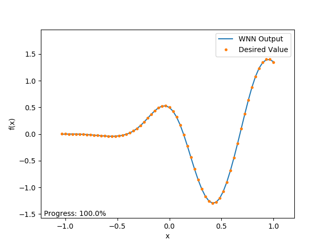
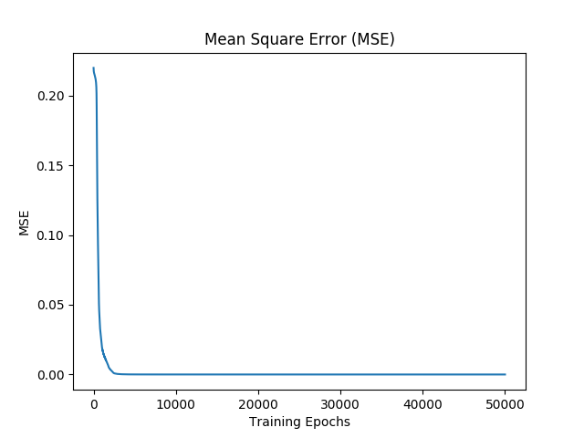

# Wavelet Neural Network

Rede Neural Artificial utilizando as funções Wavelets como função de ativação dos neurônios ocultos (_wavelons_).

    - Para mais informações, veja o arquivo `Wavelet Neural Network.ipynb`.

## Parâmetros utilizados:

* Taxa de aprendizado: 0.0005
* Número de neurônios ocultos (_wavelons_): 40

## Resultados

- Veja o vídeo (Youtube) ilustrando o funcionamento do código: [Comparison between Wavelet Neural Network and Backpropagation in the Approximation of Functions (Python)](https://youtu.be/SPHUUF-rxak)
- Média dos Erros Quadráticos: 3.95656884101e-06

